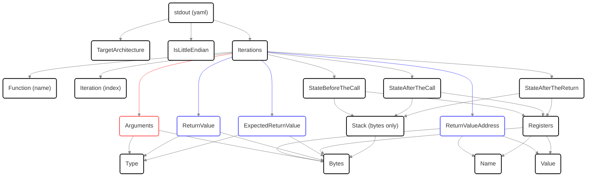
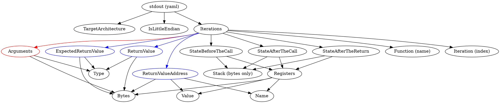

# Output of the runner

As mentioned in the [README.md](./README.md), the goal of the testing suite is to analyze the outputs of the runner binary.
This document outlines the structure of said output.



<details>
  <summary>(graphviz)</summary>



</details>

Legend:
* red arrow - this link is only present in argument tests.
* blue arrow - this link is only present in return value tests.

To summarize, each iteration contains three "state" points extracted:
* Right before the call: at the address of the call instruction.
* Right after the call: at the address of the first instruction of the function body.
* Right after the return: at the address of the instruction following the call instruction.

Each of those state points lists all the architecture specific registers in the format of `Name-Value-Bytes`.
It also contains the configured (see [here](./config/README.md#commonyml)) number of top stack bytes starting from the current value of the stack pointer as a raw `Bytes` array.

On top of that, it also provides the values of the arguments OR return values (depending on the test type, see [here](./config/functions.yml)) of the functions generated in `functions.inc` (see [here](./templates/README.md#functionsinc)).

For argument functions, only a serialized type (carried over from the original [config](./config/README.md#functionsyml)) and an array of raw bytes of the value are provided
Which should be equivalent to the output of a function like this:
```cpp
void function(type_0 arg_0, type_1 arg_1, {{ and so on }}) {
  puts("- Type: type_0\n  Bytes: [{{ arg_0 bytes }}]");
  puts("- Type: type_1\n  Bytes: [{{ arg_1 bytes }}]");
  // and so on for each remaining argument.
}
```

For return value function, on top of the value setup function (callsite) emitted, its address (to detect the cases when the value is returned as a pointer) as well as the original value that was returned are output.
Which should be equivalent to the output of a set of functions like this:
```cpp
{{ return_value_type }} callee_function(void) {
  {{ return_value_type }} return_value;

  return_value = {{ copy_random_data_in }};
  puts("ExpectedReturnValue:\n-Type: {{ return_value_type }}\n  Bytes: [{{ bytes copied in }}]");

  return return_value;
}

void caller_function(void) {
  {{ return_value_type }} return_value = callee_function();
  printf("ReturnValueAddress:\n- Name: {{ return_value_type }}\n  Value: 0x%x\n  Bytes: [{{ pointer bytes }}]\n", &return_value);
  puts("ReturnValue:\n- Type: {{ return_value_type }}\n  Bytes: [{{ return value bytes }}]");
}
```
