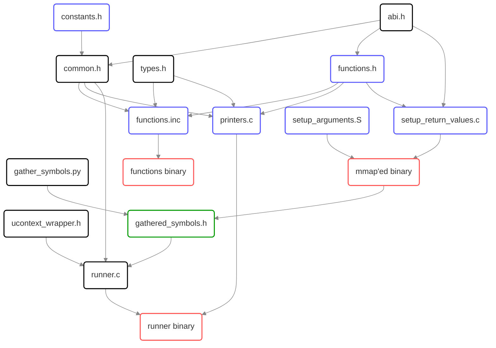

# Documentation for the templates used by this generator

Note that all the template files (marked blue on the graph) have `.jinja_template` suffix which is then stripped after generation.



<details>
  <summary>(graphviz)</summary>

```graphviz
strict digraph {
  "abi.h" -> "common.h"
  "abi.h" -> "functions.h"
  "functions.h" [color=blue]

  "constants.h" --> "common.h"
  "common.h" -> "functions.inc"
  "functions.h" -> "functions.inc"
  "types.h" -> "functions.inc"
  "functions.inc" -> "functions binary"
  "functions.inc" [color=blue]

  "common.h" -> "printers.c"
  "functions.h" -> "printers.c"
  "types.h" -> "printers.c"
  "printers.c" -> "runner binary"
  "printers.c" [color=blue]

  "setup_arguments.S" -> "mmap'ed binary"
  "setup_arguments.S" [color=blue]

  "abi.h" -> "setup_return_values.c"
  "functions.h" -> "setup_return_values.c"
  "setup_return_values.c" -> "mmap'ed binary"
  "setup_return_values.c" [color=blue]

  "gathered_symbols.h" [color=green]

  "common.h" -> "runner.c"
  "gathered_symbols.h" -> "runner.c"
  "ucontext_wrapper.h" -> "runner.c"
  "runner.c" -> "runner binary"

  "functions binary" [color=red]
  "mmap'ed binary" [color=red]
  "runner binary" [color=red]

  "mmap'ed binary" -> "gathered_symbols.h"
  "gather_symbols.py" -> "gathered_symbols.h"
}
  ```

</details>


Legend:
* blue - generated using jinja2.
* red - a binary output of a compiler (these are the outputs we are looking for)
* green - generated by a custom python script.
* black - raw sources

## `functions.h`

This file provides the prototypes of all the structs and functions defined in `function.yml` configuration file (see [here](../config/README.md#functionsyml))
They are all emitted in a format of
```cpp
void setup_{{ TEST_NAME }}(void);
{{ RETURN_VALUE }} test_{{ TEST_NAME }}({{ ARGUMENTS }});
```
where `setup_{{ TEST_NAME }}` is the function to be called by the runner,
and `test_{{ TEST_NAME }}` is the function whose prototype is to be used from the model after the binary is imported.

## `functions.inc`

This file provides the bodies of all the `test_{{ TEST_NAME }}` functions in pure C (which makes them architecture-independent).

## `printers.inc`

This file provides the way to decode information "dumped" by the functions from `functions.inc` into the final yaml format (see the [relevant doc](../output_format.md)) on a test-by-test basis.

Note that it provides a dispatcher-style function `"print"` which takes function name as an argument to pass the decoding to the correct instance of the printer.

## `setup_arguments.S`

This file provides generated into pure assembly bodies for `setup_{{ TEST_NAME }}` functions. Note that the outputs are architecture-specific.

For more details, see the [explanation of the relevant config](../config/README.md#architecturesyml).

TODO: extend with the explanation of styles once they are finalized in the future PR.

## `setup_return_values.inc`

This file provides the return value counter-part of the test setup. Thanks to the simplicity of the new test suite, it can be written in C instead of assembly.

## `constants.h`

This file provides acouple of extra values passed from the generator to the script to keep all the configs in [a single place](../config/common.yml) instead of having to update them all over the place when such an update is needed.

## `types.h`

Due to not wanting to lock ourselves into a single compiler ecosystem, we are not able to rely on the compiler-specific data type logic, which leads to have to generate a "universal" solution based on the data we already have within the generator script. It takes a shape of `_Generic` macro (C11) which provides an unambiguous way to decide whether a specific type will be treated as a scalar or as an aggregate.
