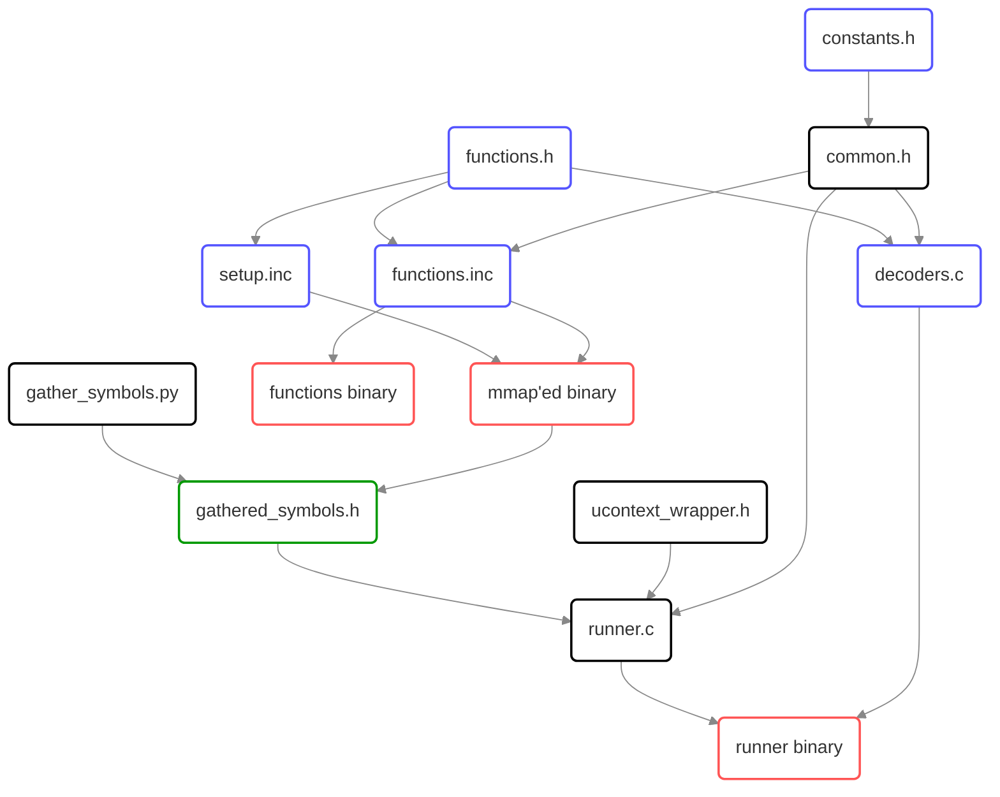

# Documentation for the templates used by this generator

Note that all the template files (marked blue on the graph) have `.jinja_template` suffix which is then stripped after generation.



Legend:
* blue - generated using jinja2.
* red - a binary output of a compiler (these are the outputs we are looking for)
* green - generated by a custom python script.
* black - raw sources

## `functions.h`

This file provides the prototypes of all the structs and functions defined in `function.yml` configuration file (see [here](../config/README.md#functionsyml))
They are all emitted in a format of
```cpp
void setup_{{ TEST_NAME }}(void);
{{ RETURN_VALUE }} test_{{ TEST_NAME }}({{ ARGUMENTS }});
```
where `setup_{{ TEST_NAME }}` is the function to be called by the runner,
and `test_{{ TEST_NAME }}` is the function whose prototype is to be used from the model after the binary is imported.

## `functions.inc`

This file provides the bodies of all the `test_{{ TEST_NAME }}` functions.

## `decoders.inc`

This file provides the way to decode information "dumped" by the functions from `functions.inc` into the final yaml format (see the [relevant doc](../output_format.md)) on a test-by-test basis.

Note that it provides a dispatcher-style function `"decode"` which takes function name as an argument to pass the decoding to the instance of the printer that corresponds to it.

## `setup.inc`

This file provides the bodies of all the `setup_{{ TEST_NAME }}` functions.

## `constants.h`

This file provides a couple of extra values passed from the generator to the script to keep all the configs in [a single place](../config/common.yml) instead of having to update them all over the place when such an update is needed.
