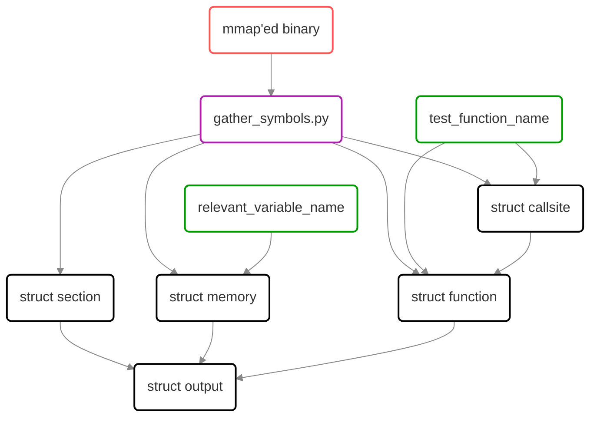
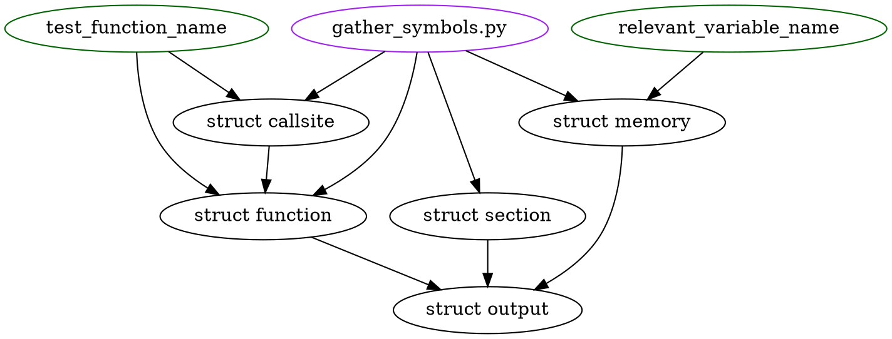

# A script for extracting addresses from the disassembler output

(TODO: since the "frontend" of the script is not finalized yet (we'll need a separate `dumpbin` edition), this file only describes the backend)

As the result of the script execution, a header is created, its structure is shown in this graph:



<details>
  <summary>(graphviz)</summary>



</details>

Legend:
* black - a `struct` in the output C header
* purple - a Python script.
* red - a binary output of a compiler.
* green - contents of `tests_list.txt`.

The `struct output` (a static instance of which the header also provides) contains  arrays of objects `runner.c` needs:
```cpp
struct output {
  struct section sections[1];
  struct memory variables[2];
  struct function functions[63];
};
```
* `sections` - lists sizes and offsets (both virtual and within the file) of sections we're interested in. For now that's only `.text`, but it might be extended in the future.
  ```cpp
  struct section {
    char name[6];
    uint64_t size, vma, file_offset;
  };
  ```
* `variables` - lists addresses for the memory locations passed as an argument for the `gather_symbols.py` script
  ```cpp
  struct memory {
    char name[19];
    uint64_t address;
  };
  ```
* `functions` - lists addresses of the applicable (*) functions
  ```cpp
  struct function {
    char name[48];
    uint64_t address;
    uint64_t entry_point;
    uint64_t callsite_count;
    struct callsite callsites[1];
  };
  ```
  (*) a single object of this type (let's say `X`) is created for each pair of functions present in the input dump: `setup_X` and `test_X`. Based on those two functions, the fields are set as such:
  * `address` - the entry point of `test_X` function (we want to interrupt here)
  * `entry_point` - the address to jump to in order to start the current test, that is, the entry point of `setup_X` function.
  * `callsite_count` - the number of callsites found for `test_X` function.
  * `callsites` - said callsites listed as:
    ```cpp
    struct callsite {
      uint64_t before, after;
    };
    ```
    Where:
    * `before` - the address of the call instruction.
    * `after` - the address of the very first instruction after the call.
